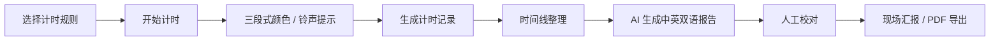
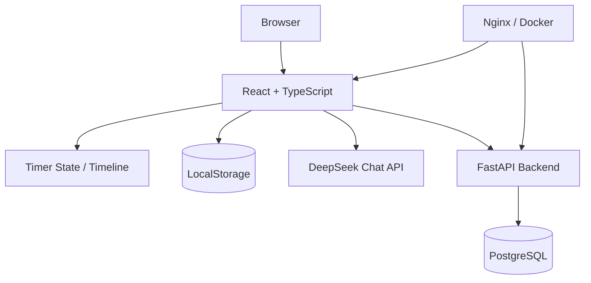

<div align="center">


# Toastmaster Timer Tools
### 头马时间官助手

**把“举计时牌”变成一套可记录、可复盘、可生成报告的会议时间工作流。**

[English](README_EN.md) · [快速开始](#快速开始) · [产品工作流](#产品工作流) · [技术架构](#技术架构)

<p>
  
  
  
  
</p>

</div>


## 为什么做这个工具

Toastmasters 会议里的 Timer 看起来只是“计时”，但实际工作往往包含一整条流程：

```text
选择规则
  ↓
现场计时
  ↓
颜色 / 铃声提醒
  ↓
记录每位参与者用时
  ↓
整理时间线
  ↓
会议末尾口头汇报
  ↓
会后复盘 / 导出
```

如果只做一个倒计时器，真正麻烦的后半段仍然需要人工完成。

这个项目的目标，是把 Timer 从一个单点工具变成一套**完整的会议时间工作流**。

## 产品工作流



### 1. 现场计时

- 内置多种 Toastmasters 常见计时组合；
- 支持自定义时间段、颜色、铃声和显示方式；
- 支持暂停、继续、重置和结束；
- 大屏区域专注展示当前计时状态。

### 2. 三段式提示

通过颜色和铃声把 Toastmasters 常用的时间提醒规则显性化：

**🟢 正常阶段 → 🟡 提醒阶段 → 🔴 时间上限 / 超时阶段**

计时规则可以复制后再自定义，而不是把所有场景硬编码成一个固定倒计时器。

### 3. 时间线

每次计时会生成结构化记录，用于：

- 查看当天所有计时结果；
- 修改姓名和备注；
- 按时间排序；
- 删除 / 恢复记录；
- 给 AI 报告提供结构化输入。

### 4. AI 时间官报告

项目把会议 Agenda 与实际用时整理成结构化数据，再交给 LLM 生成适合现场朗读的 Timer Report。

当前实现支持：

- 中文 / English 双语结果；
- 一句话总结 + 完整报告；
- 按会议板块组织，而不是简单逐人罗列；
- Prompt 模板可修改；
- AI 版本与人工编辑版本并存；
- 报告保存到浏览器本地；
- PDF 导出。

> 当前源码通过 DeepSeek Chat Completions 接口调用模型，模型 ID 在代码中配置。若上游模型名称或 API 规则变化，需要同步调整 `src/utils/ai.ts`。

## 从“工具”到“产品”的关键设计

这个项目对我更有价值的部分，并不是计时器本身，而是几个产品化决策：

### 计时数据先结构化，再交给 AI

不是直接把一段会议描述丢给 LLM，而是先生成：

- 计划时间；
- 实际时间；
- 超时时长；
- 会议环节；
- 参与者；
- 总体统计。

AI 负责的是**组织表达和总结**，基础时间计算仍由确定性逻辑完成。

### AI 结果允许人工接管

现场报告属于真实会议输出，因此 AI 结果不是最终真相：

```text
AI draft → human review → editable version → final report
```

### 本地优先保存个人设置

当前 API Key、Prompt 和 AI 报告使用浏览器 `localStorage` 保存。

这让个人使用足够轻量，但也意味着：

> **如果把它部署成多人共享的公共服务，不应该把浏览器 localStorage 当成专业的密钥管理方案。**

共享生产环境更适合通过服务端代理、密钥托管和用户权限隔离处理模型调用。

## 主要能力

| 模块 | 能力 |
| --- | --- |
| Timer | 多种预设计时组合、自定义规则、暂停/继续/重置 |
| Visual Cue | 分阶段颜色提示 |
| Audio Cue | 本地音频预加载与铃声提示 |
| Timeline | 结构化计时记录、编辑、排序、软删除 |
| AI Report | 中英双语 Timer Report、可编辑 Prompt |
| Report Editing | AI / 人工版本切换与修改 |
| Export | PDF 输出 |
| Web App | React + TypeScript 响应式界面 |
| Backend | FastAPI + PostgreSQL |
| Deployment | Docker / Docker Compose / Nginx |

## 技术架构



### Frontend

- React 19
- TypeScript 5
- Vite
- Tailwind CSS
- React Context + reducer-style state management
- browser LocalStorage

### Backend

- FastAPI
- SQLAlchemy
- PostgreSQL
- Pydantic
- JWT / authentication-related dependencies

### Deployment

- Docker
- Docker Compose
- Nginx

## 快速开始

### 方式一：前端开发

```bash
npm install
npm run dev
```

默认由 Vite 启动开发服务器。

构建：

```bash
npm run build
```

### 方式二：完整 Docker 环境

仓库包含前端、FastAPI Backend 与 PostgreSQL 的 Docker Compose 配置：

```bash
docker compose up --build
```

当前 Compose 暴露：

- Frontend: `8080`
- Backend: `8000`
- PostgreSQL: `5432`

> 默认数据库账号仅适合本地开发示例。公开部署前应修改密码、关闭不必要的数据库端口暴露，并通过环境变量 / Secret Manager 管理敏感配置。

## AI 报告的输入逻辑

项目会把计时记录转换成类似下面的结构：

```json
{
  "items": [
    {
      "name": "Speaker A",
      "expected_seconds": 420,
      "actual_seconds": 438,
      "overtime_seconds": 18,
      "status": "轻微超时"
    }
  ],
  "stats": {
    "total_speakers": 1,
    "on_time_count": 0,
    "overtime_count": 1
  }
}
```

这样可以把“计算”和“语言生成”分开：

> **程序负责事实，AI 负责表达。**

这是我做 AI 产品时比较坚持的一条原则。

## 项目结构

```text
.
├── src/                 # React / TypeScript 前端
├── public/              # 图片、音频与静态资源
├── backend/             # FastAPI 后端
├── Dockerfile
├── docker-compose.yml
├── nginx.conf
├── package.json
└── README.md
```

## 当前状态

这是一个面向真实 Toastmasters 会议场景的产品实验。

如果继续演进，我认为比继续增加“更多计时按钮”更值得做的是：

- 会议 Agenda 直接导入；
- 角色与人员自动关联；
- 报告生成过程可观测；
- AI Report Evaluation；
- 多俱乐部 / 多用户的数据隔离；
- 更安全的模型 API 调用；
- 与更完整的俱乐部会议协作系统连接。

## 关于项目

我喜欢这类项目，因为它们通常不是从“我要用 AI 做什么”开始，而是从一个很具体的问题开始：

> **Timer 在现场究竟有哪些重复、容易出错、可以被软件接管的工作？**

然后再决定哪些应该用普通程序解决，哪些才值得交给 AI。

---

<div align="center">

**Use deterministic software for facts. Use AI where judgment and language actually help.**

[GitHub Profile](https://github.com/kevin-meng)

</div>
