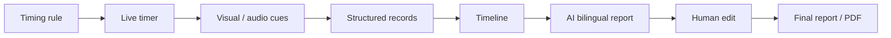
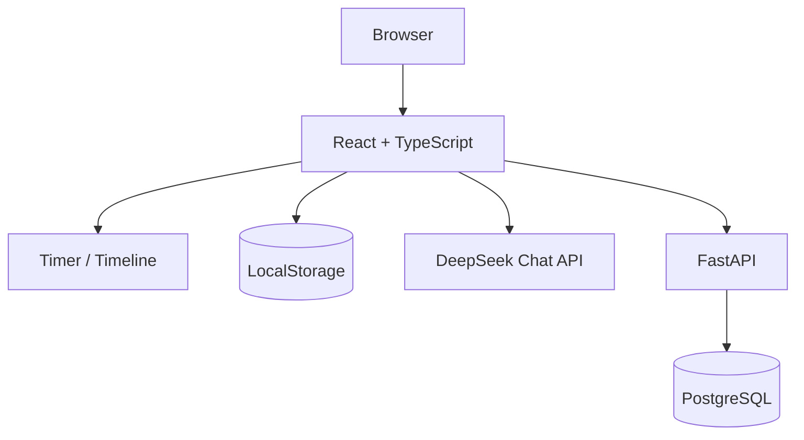

<div align="center">


# Toastmaster Timer Tools

### A timer workflow for Toastmasters meetings — from live timing to structured records and AI-assisted reports.

[中文](README.md)

</div>


## Why this project

A Toastmasters Timer does more than run a stopwatch. The real workflow includes selecting timing rules, giving visual/audio cues, recording each session, summarizing timing performance, and reporting back to the room.

This project turns that workflow into one system:



## Product principles

**Structure first, generate second.**  
Timing facts are calculated deterministically before the data is sent to an LLM.

**Human review stays in the loop.**  
AI produces a draft; the user can edit it before it becomes the final meeting report.

**AI only where it helps.**  
A model is useful for summarization and natural-language reporting, not for calculating elapsed seconds.

## Features

- predefined and custom timing combinations;
- staged color and audio cues;
- structured meeting timeline;
- editable timing records;
- bilingual AI Timer reports;
- editable prompt templates;
- manual editing after AI generation;
- PDF export;
- React frontend;
- FastAPI + PostgreSQL backend;
- Docker Compose deployment.

## Architecture



The current browser implementation stores the model API key, prompt template and generated reports in localStorage. That is convenient for personal/local use, but a shared production deployment should move secrets behind a server-side boundary.

## Quick start

Frontend development:

```bash
npm install
npm run dev
```

Full Docker environment:

```bash
docker compose up --build
```

The current Compose setup exposes the frontend on `8080`, FastAPI on `8000`, and PostgreSQL on `5432`.

## Stack

- React 19
- TypeScript 5
- Vite
- Tailwind CSS
- FastAPI
- SQLAlchemy
- PostgreSQL
- Docker / Nginx

## What I learned

The interesting part of this project is the boundary between deterministic software and generative AI:

```text
meeting events
    ↓
structured facts
    ↓
deterministic timing statistics
    ↓
LLM language generation
    ↓
human review
```

That pattern is reusable well beyond Toastmasters.

---

**Use deterministic software for facts. Use AI where judgment and language actually help.**
